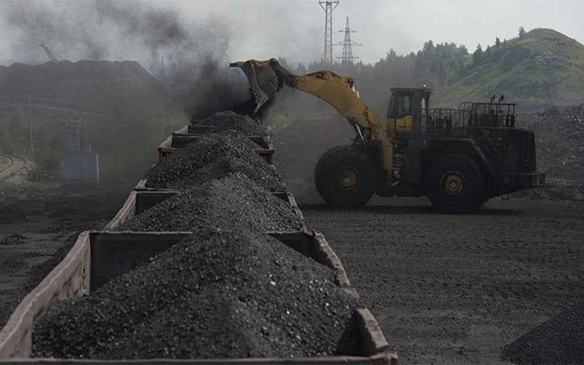
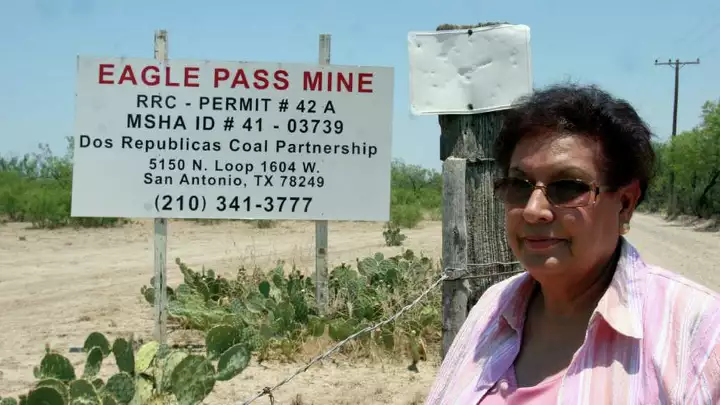
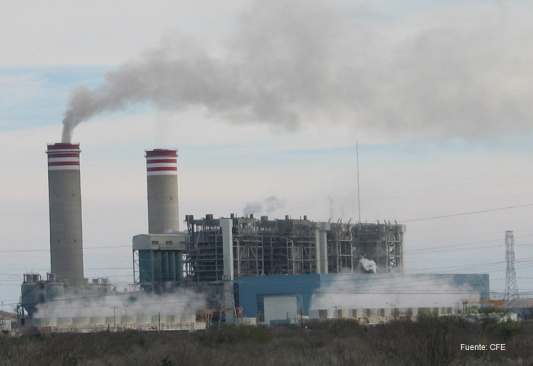

* Strategic economic activities  **Coal minning** and **electricity** generation burnig coal as input. 

Fuente: [MICARE MINOSA  Dos Repulicas Coal Partnership]()  

* Binational economic integration: Comlementary **Coal imports** (*Dos Republicas Coal partnership* MINOSA at Eagle Pass Maverick County, Texas) and electricity export potential. Coahuila-Texas grid. 

Fuente: [Energy and Commerce](https://energyandcommerce.com.mx/cfe-ofrece-compra-emergente-de-carbon-a-coahuila/)  

Fuente: San Antonio News  

* Local **air pollution** and regional public health issues with relevant **social cost**. 

* A region hosting the biggest **sulfur dioxide** SO2 contamination source among carbon-burning electricity generation plants in North America. (2,869 sites, including all US and Canadian plants). As well as the first place in the group of **nitrogen oxides** (NOx) <cite> NACEC [^1]</cite>

Fuente: CFE 

[^1]: See full report on  [CEC](http://www.cec.org/es/publications/emisiones-atmosfericas-de-las-centrales-electricas-en-america-del-norte-2/).

* Coahuila-Texas border:  Higher than national morbidity rates for **respiratory diseases**

> **Goal**: Contribute to understand the relationship between <mark>environmental<mark> factors of anthropogenic origin and the health conditions of the population. 

