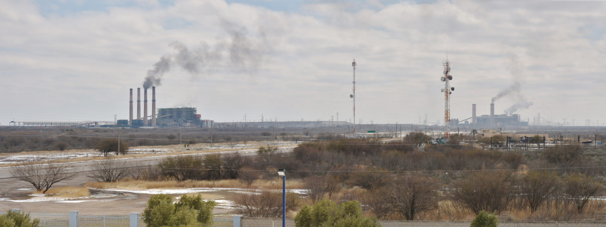

## Environmental health

* **WHO** perspective on human health including life quality and its social considerations.  (Not only the traditional quimical, fisical and biological factors that are determined on the environment).

* Environmental **justice**  (strong social component)

* Social implications: High social costs for families, including school absenteeism and productivity losses. 

* Expensive out of pocket treatment cost reaching annual $1,600 USD expenditures.

* Lack of health care coverage and access to medical treatment for low income families.  

## Economic activity and environmental pollution

* **Coahuila** as the leading **coal** producer of the country.
Production valued at 7.02 MMP annually (351 Million USD)

* Old (outdated) energy generation models.  

* Regional hub for electricity generation (producing **10%** of the country's electricity consumption). Two **CFE** plants.

* **PM2.5  SOx, NOx** By-product waste generated: **Mercury**   1,7 tons.  and 12,000 **ash** and **coal dust** containing heavy metals. 

* Estimated affected area. **12, 000 km2.** 

**Fig. 1 Study area**

}}index_flies/figures-html/CFE I y II_v2.jpg" alt="." width="672" />

Fuente: Elaboración propia con datos de (INEGI, 2024a; US Census Bureau, 2024b),  

Fuente: El Heraldo de Saltillo 

Fuente: Infobae 

