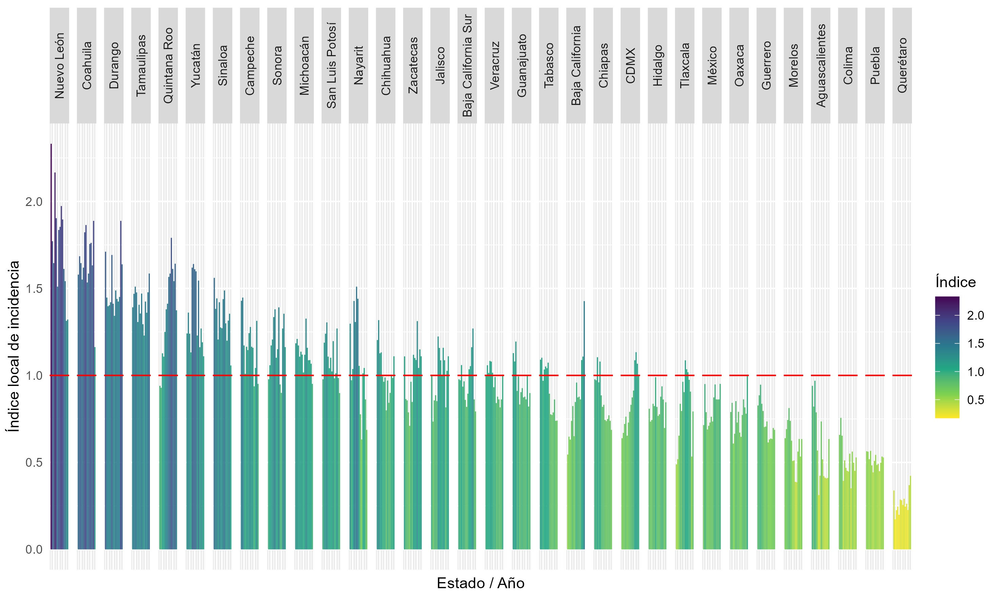
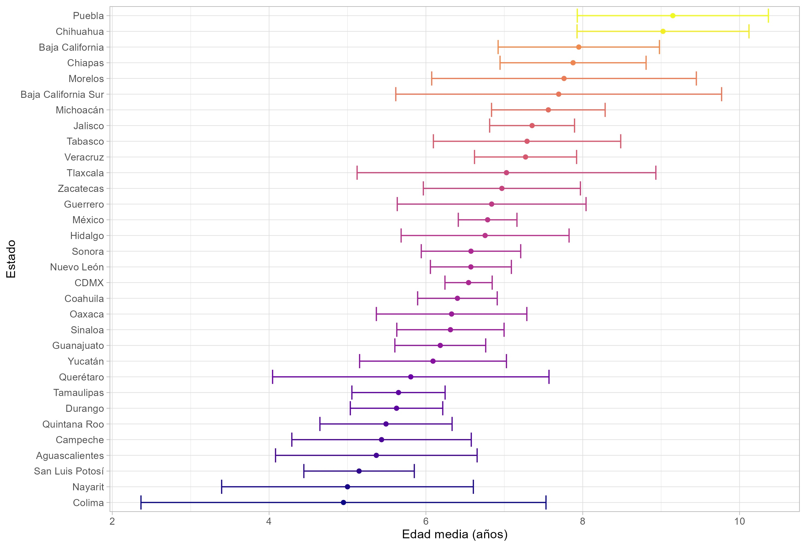
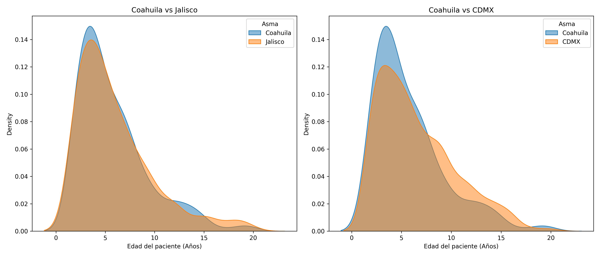

**Figure 2** Local Incidence Index.

Fuente: Elaboración propia con datos para los años 2004 a 2022 (SINAIS, 2022). 

Although the proposed indicator is a relative measure of concentration and **controls for the population size** of the states compared to the national level, the age-specific structure in these geographic areas could introduce biases in the estimation of the Relative Concentration Index (ILI).

Therefore, the age distribution by hospital discharge for the case of Coahuila is explored below, based on the construction of **Kernel density curves** according to Chen (2017).

**Figure  3** Average age of hospital discharges by State 2022. (T-test with 95% confidence intervals).

Fuente: Elaboración propia con datos de (SINAIS, 2022) 

**Figure 4**. Age distribution for hospital discharges. asthma patientes in Coahuila, CDMX, and Jalisco 2022.

Fuente: Elaboración propia con datos de (SINAIS, 2022)</span
